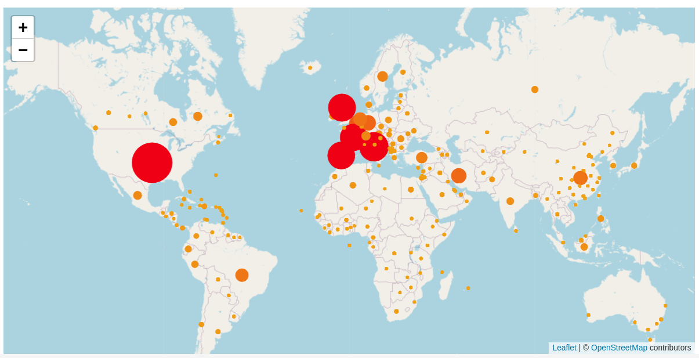

The Covid 19 pandemic has caused shocking tragedy for many and altered all our lives. The exploration of this data was done as I found it difficult to find the exact information I wanted in one place. Also since there was a lot of misinformation being spread relating to COVID19 I decided that I wanted to visualise some of the data available.

I was keen to do this as I wanted to keep an eye on what was happening around me. I was also keen to see if I could compare datasets to try and produce some visualisations to disprove some of the more extreme view points relating to the outbreak.

No offense is intended by this data exploration and my condolences go out to anyone affect by the virus.

## ObservableHQ and covid19api.com

Being my first time using ObservableHQ, I decided to start simple, so that I could get to know the platform and what was possible. I started out by creating a ObservableHQ notebook consuming the covid19api.com JSON API and created a simple graph in Vega Lite.

You can view this notebook here: https://observablehq.com/d/ed92b04582f8b2e6

> What I learnt:
> 
> * For the most part ObservableHQ notebooks are just like writing pure JavaScript
> * Vega Lite 
> * covid19api.com was not accurate enough in all cases

I decided this exploration that I would need to use another dataset but that ObservableHQ is a very handy platform.

## ObservableHQ and John Hopkins data graph and map

I next used the John Hopkins data available at  https://github.com/CSSEGISandData/COVID-19/blob/master/csse_covid_19_data/csse_covid_19_time_series to graph the data.

You can view this notebook here: https://observablehq.com/@purplehexagon/dynamic-covid19-death-data-repository-by-johns-hopkins-css

I wanted to be able to switch between log and linear scales and be able to view the data per 100000 of population.

I also decided to map this data to see where hotspot areas for infection are.

Which can be viewed here https://observablehq.com/@purplehexagon/map-covid19-death-data-repository-by-johns-hopkins-csse

## ObservableHQ and NHS Data

I was also keen to see how the virus was spreading in different age groups and regions. For this NHS England data was used.

Regional graph can be viewed here https://observablehq.com/@purplehexagon/covid-region-deaths-graphed

Age graph can be viewed here https://observablehq.com/@purplehexagon/covid-age-deaths-graphed

